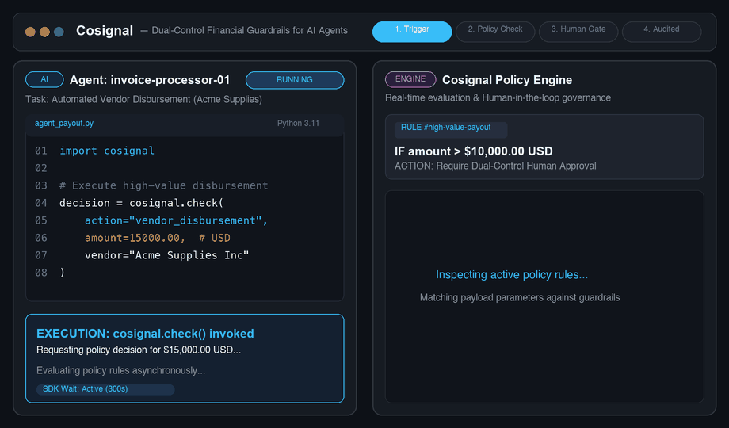
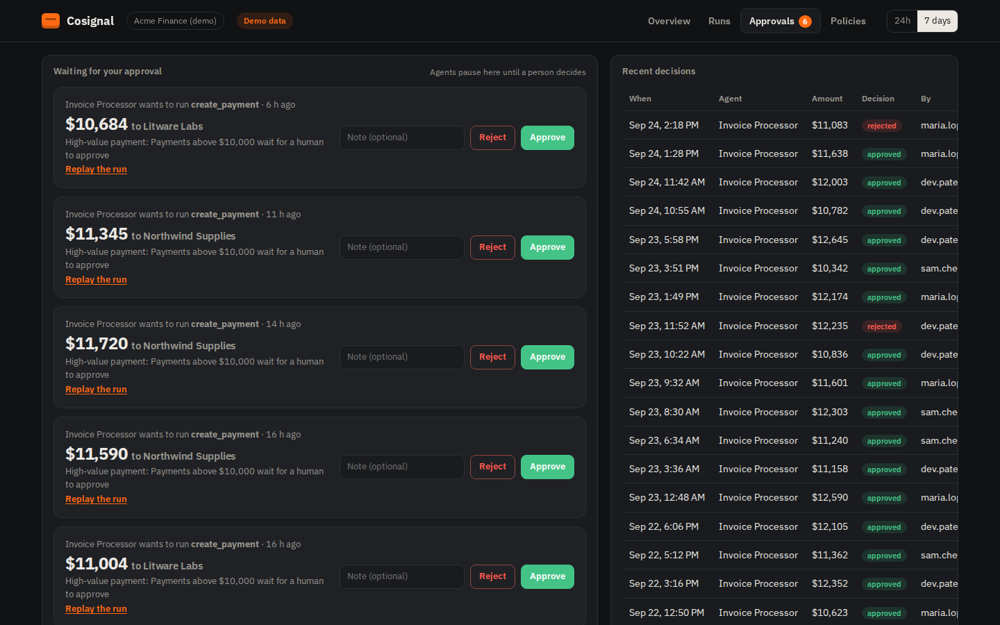
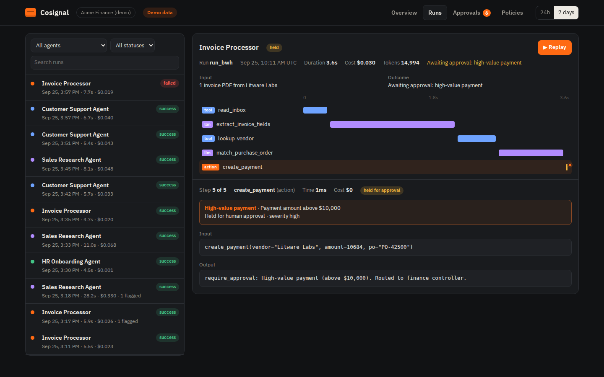
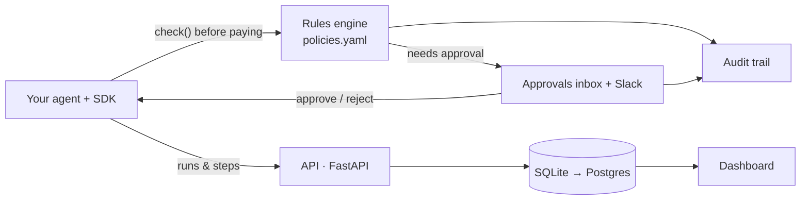

# Cosignal

**Open-source human-in-the-loop approval, policy enforcement, and audit trails for AI agents that execute payments and financial actions.**

[](https://github.com/naveditachaudhary-pixel/cosignal/actions/workflows/tests.yml)
[](LICENSE)
**[▶ Try the live demo](https://naveditachaudhary-pixel.github.io/cosignal/)** · no sign-up, sample data



AI agents now pay invoices, issue refunds and move funds. Cosignal sits between your agent and the money:

- **Guard:** before a payment runs, the agent checks your rules. Over $10,000? First payment to a new vendor? The action **waits for a person to approve it**.
- **Approve:** reviewers get a Slack message and an inbox with **Approve / Reject** buttons. The agent continues the moment someone decides.
- **Record & replay:** every step the agent took (model calls, lookups, actions, cost) is recorded, so any run can be replayed like a flight recorder.
- **Audit:** every guardrail check and human decision lands in an append-only audit trail, ready for your auditors.



## Why

Most tools for AI agents are built for the engineers debugging them. The people accountable for an agent that pays vendors (finance controllers, AP managers, risk teams) need something different: **limits they can set, a place to approve exceptions, and proof of who approved what.** That is the "maker-checker" / dual-control principle banks already use, applied to AI agents.

## Quick start (1-Click or Manual)

### Option 1: 1-Click Launch (Recommended)
```bash
git clone https://github.com/naveditachaudhary-pixel/cosignal.git && cd cosignal
./start.sh
```
`./start.sh` automatically configures the Python virtual environment, installs dependencies, launches the server, and opens your browser directly to `http://localhost:8000`.

### Option 2: Manual Start
```bash
git clone https://github.com/naveditachaudhary-pixel/cosignal.git && cd cosignal
pip install -r requirements.txt
uvicorn server.app:app --port 8000          # API + dashboard
python -m examples.simulate_agents          # two weeks of sample agent traffic
open http://localhost:8000                  # the badge switches to "Live"
```

## Add it to your agent

The SDK is a single file with no dependencies.

```python
from cosignal import Cosignal
lens = Cosignal(agent="invoice-processor")            # COSIGNAL_URL defaults to http://localhost:8000

with lens.run(input=email.subject) as run:
    with run.step("llm", "extract_invoice", model="gpt-4o") as s:
        invoice = extract(email)                          # your code
        s.tokens(usage.input, usage.output).output(invoice)

    decision = run.check("create_payment", amount=invoice["amount"],
                         vendor=invoice["vendor"], wait=300)   # waits up to 5 min for a human
    if decision.allowed:
        with run.step("action", "create_payment", amount=invoice["amount"]):
            pay(invoice)
    else:
        notify_ap_team(decision.reason)                   # rejected, or still waiting
```

- Step kinds: `llm`, `tool`, `retrieval`, `action`. Errors are captured automatically; cost is computed from tokens.
- If the server is unreachable the SDK never crashes your agent: runs are buffered and sent later, and checks fail open (or closed, with `Cosignal(fail_closed=True)`).

## Set your own rules

Rules live in [`policies.yaml`](policies.yaml), not in code:

```yaml
rules:
  - id: high-value-payment
    name: High-value payment
    actions: [create_payment, wire_transfer, refund]
    when:
      - {field: amount, op: gt, value: 10000}
    decision: require_approval      # allow | flag | require_approval | block
    severity: high
```

Edit the file, then `POST /v1/policies/reload` (no restart). Included rules: high-value payment, payment review band, first payment to a new payee, external email, customer PII access, runaway cost per run.

## Get notified

```bash
export COSIGNAL_SLACK_WEBHOOK=https://hooks.slack.com/services/...   # Slack incoming webhook
export COSIGNAL_WEBHOOK_URL=https://your-system/hooks/cosignal       # any JSON webhook
export COSIGNAL_PUBLIC_URL=https://cosignal.your-company.com         # used in the message link
```

## What's in the dashboard

| View | What it shows |
|---|---|
| Overview | Runs, success rate, spend, risky actions caught, a reliability score per agent, plain-language alerts |
| Runs | Every run, with step-by-step **Replay** |
| Approvals | Held actions waiting for a person, recent decisions, and the full audit trail |
| Policies | Your rules, what each one does, and how often it fired |



## API

| Method | Path | Purpose |
|---|---|---|
| POST | `/v1/runs` | Ingest a run (the SDK does this) |
| POST | `/v1/check` | Guardrail decision before an action; creates an approval request when needed |
| GET | `/v1/approvals` | Approval requests (`?status=pending`) |
| POST | `/v1/approvals/{id}/decision` | `{"decision": "approve" \| "reject", "by": "...", "note": "..."}` |
| GET | `/v1/audit` | Append-only log of checks and human decisions |
| GET | `/v1/runs`, `/v1/runs/{id}` | Browse runs |
| GET | `/v1/agents`, `/v1/alerts`, `/v1/policies` | Scores, alerts, active rules |

Set `COSIGNAL_KEYS=key1,key2` to require an `X-Cosignal-Key` header.

## Architecture



## Roadmap

- [x] Recording, replay, reliability scores, alerts
- [x] Rules file, approvals inbox, Slack/webhook notifications, audit trail
- [ ] Integrations: OpenAI Agents SDK, LangChain / LangGraph
- [ ] `pip install` package and one-command Docker setup
- [ ] Redact card numbers and personal data in the SDK before sending
- [ ] Hosted version with sign-in and Postgres

Ideas and pull requests welcome: see [CONTRIBUTING.md](CONTRIBUTING.md).

## License

MIT © 2026 Navedita Chaudhary
